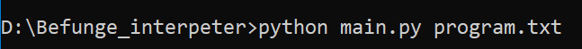

# Консольное приложение "Интерпретатор Befunge"

Автор: [Бикбулатов Владислав](https://github.com/Vladik74)

## Описание
Простой интерпретатор программ на языке Befunge.

## Требования
* Python

## Состав
* консольное приложение `main.py`
* файл с логикой `interpreter.py`
* файл с исключениями интерпретатора `exceptions.py` (пока пустой)

## Запуск
`python main.py [-h] [-i INPUT_FILE] program_file`  
`-h` - справка по аргументам
Ответ программы выводится в файл `output.txt`

##Пример
Запуск: 
Файл `program.txt`:
```bf
"!dlroW ,olleH">:v
               |,<
               @
```
Файл `output.txt`:
```bf
Hello, World! 
```